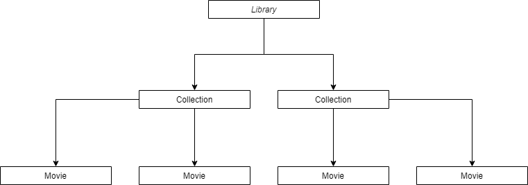
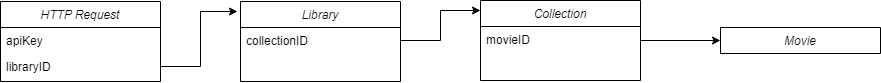

### 1. Identyfikacja zagadnienia biznesowego
Celem projektu jest stworzenie aplikacji, która umożliwi użytkownikom łatwe i intuicyjne tworzenie oraz zarządzanie spersonalizowanymi katalogami filmów. 
Aplikacja pozwala na tworzenie, modyfikowanie i usuwanie katalogów filmów wewnątrz jego biblioteki, a także na zarządzanie poszczególnymi filmami poprzez dodawanie,
usuwanie i zmianę ich nazw. Wszystkie operacje są realizowane za pośrednictwem serwisu bunny.net, wiodącego dostawcy usług CDN (Content Delivery Network). 
Dodatkowo, aplikacja umożliwia autoryzację i powiązanie konta użytkownika z serwisem bunny.net bezpośrednio z poziomu aplikacji. Aplikacja ma przyciągać użytkowników
swoją prostotą i wygodą w zarządzaniu katalogami ulubionych filmów, wzorując się na popularności i funkcjonalności aplikacji do strumieniowania muzyki, 
które umożliwiają łatwe tworzenie playlist jako kluczową cechę. Sprecyzowane cele i potrzeby są w pełni zrealizowane w aplikacji będącej produktem projektu.
Możliwe rozszerzenia funkcjonalności obejmują wprowadzenie systemu rekomendacji bazującego na upodobaniach użytkownika oraz tematyce poszczególnych katalogów filmów,
a także utworzenie systemu automatycznego tworzenia tematycznych katalogów filmowych.

### 2. Wymagania systemowe i funkcjonalne
Projekt zbudowany jest według reguł architektury MVC oraz dzieli się na dwie części: serwerową oraz kliencką. Komunikacja między tymi częściami odbywa się 
asynchronicznie z wykorzystaniem REST API. 

Część serwerowa wykorzystuje środowisko uruchomieniowe Node.js oraz framework Express, korzysta ona z relacyjnej bazy danych SQLite przy wykorzystaniu Sequalize,
który pełni tutaj role ORM'a (Object-Relational Mapping). Serwer posługuje się również otwartym standardem przemysłowy JWT (JSON Web Token). Pozyskiwanie informacji 
oraz filmów odbywa się przy pomocy API serwisu bunny.net na którym bazuje cała aplikacja i na którym przechowywane są biblioteki, wchodzące w ich skład katalogi oraz filmy
które są w nich zawarte.. W celu zapewnienia bezpieczeństwa wykorzystywana jest również biblioteka Bycrypt.

Część kliencka opiera się na wykorzystaniu biblioteki React.

Funkcjonalności aplikacji:

Zarządzanie katalogami filmów:
- Utworzenie nowego katalogu
- Zmiana nazwy katalogu
- Usunięcie katalogu
- Dodanie filmu do katalogu
- Usunięcie filmu z katalogu
    
Zarządzanie filmami:
- Dodanie filmu
- Zmiana nazwy filmu
- Usunięcie filmu
- Podgląd filmu

### 3. Analiza zagadnienia i jego modelowanie
Baza danych:
    


- id: numer porządkowy użytkownika
- username: nazwa wybrana przez użytkownika
- email: adres email użytkownika
- password: hasło użytkownika
- apiKey: klucz API slużący do powiązania konta z bunny.net
- libraryID: numer porządkowy biblioteki w której przetrzymujemy katalogi z filmami

Biblioteki, katalogi oraz filmy przechowywane są po stronie serwisu bunny.net, aplikacja uzyskuje do nich dostęp poprzez powiązanie konta użytkownika z kluczem API
oraz numerem porządkowym biblioteki. Z tego powodu w bazie danych konieczne jest jedynie przechowywanie informacji o użytkownikach.

Przepływ danych z API bunny.net:

Aplikacja korzysta z API serwisu bunny.net, jak zostało wspomniane powyżej w bazie danych aplikacji przechowywane są tylko informacje o użytkownikach. 
W celu pozyskania informacji o danej bibliotece, katalogach które się w niej znajdują oraz filmach w nich zawartych, aplikacja wykonuje zapytania na
odpowiednie Endpointy serwisu bunny.net wykorzystując odpowiednie parametry uzyskane z bazy danych użytkowników. Odpowiedzi są następnie przetwarzane
przez część kliencką aplikacji i wyświetlane w przejrzysty oraz uporządkowany sposób, co umożliwia użytkownikowi na wygodne korzystanie z aplikacji.

Po zalogowaniu użytkownik przenoszony jest na stronę główną: tam następuje najpierw zapytanie do naszej aplikacji o klucz API jak i o ID biblioteki, 
oba powiązane z kontem użytkownika, następnie korzystając z elementu Categories wysłane zostaje zapytanie do serwisu bunny.net, korzystając z klucza
API jako autoryzacji oraz z ID biblioteki jako parametru w adresie URL, na tej podstawie zwracana jest lista katalogów, która wyświetlana jest 
użytkownikowi na stronie głównej. Zależnie od wyboru użytkownika następnym krokiem może być np. wejście w konkretny katalog lub utworzenie nowego:
wykonywane jest wtedy kolejne zapytanie w przypadku wyboru katalogu wykorzystujące jako parametr zarówno ID biblioteki jak i samego katalogu. W 
analogiczny sposób użytkownika ma możliwość uploadu oraz usunięcia danego filmu z katalogu, jak również jego podglądu.

Układ danych po stronie serwisu bunny.net:



Schemat zapytania do serwisu bunny.net wykorzystuje klucz API do autoryzacji użytkownika na platformie bunny.net.
Każde ID służy do identyfikacji konkretnego obiektu po stronie serwisu. Zidentyfikowane ID może być użyte do uzyskania kolejnego, bardziej szczegółowego obiektu,
który jest częścią wcześniej uzyskanej większej kolekcji. Proces ten kontynuuje się, aż do uzyskania ID danego filmu.



Endpointy:

Endpointy dzielą się na te powiązane z obsługą bazy danych użytkowników oraz autoryzowaniem tychże, a także na te związane z użytkowaniem aplikacji oraz 
komunikacją z serwisem bunny.net.

Związane z autoryzacją użytkownika
- POST /login - pozwala na zalogowanie użytkownika
- POST /logout - pozwala na wylogowanie użytkownika
- POST /signup - pozwala zarejestrować nowego użytkownika
- GET  /isLoggedIn - pozwala na sprawdzenie czy użytkownik jest zalogowany

Związane z użytkowaniem aplikacji
- GET  /profile - pozwala na otrzymanie informacji
- POST /addApiKey - pozwala na przypisanie klucza API do konta danego użytkownika 
- GET  /getApiKey - pozwala na uzyskanie klucza API zawartego w encji związanej z danym użytkownikiem
- POST /deleteApiKey - pozwala na usunięcie klucza API z konta danego użytkownika
- POST /addLibraryID - pozwala na dodanie biblioteki o podanym ID do konta danego użytkownika
- GET  /getLibraryID - pozwala na uzyskanie biblioteki o podanym ID związanym z danym użytkownikiem

### 4. Implementacja

Aplikacja korzysta z technologi wymienionych w punkcie 2.: Node.js, Express, React, SQLite, Sequalize, JWT, Bycrypt.


Aplikacja dzieli się na część serwerową oraz kliencką, odpowiadające kolejno katalogom `./client` oraz `./server`. W tym rozdziale omówione jest każdy
z nich z osobna.

Serwer:

W katalogu znajdują się 2 foldery; `./server/src/Auth` oraz `./server/src/User` oraz 2 pliki; `./server/src/database.js` i `./server/src/index.js`.
`database.js` jest plikiem zawierającym definicje Sequlize, determinuje też baze danych jako SQLite.

```js
const sequelize = new Sequelize({
  dialect: 'sqlite',
  storage: './database.sqlite'
});
```

`index.js` jest punktem głównym dla naszej aplikacji od strony serwera, odpowiada między innymi za synchronizacje bazy danych:

```js
sequelize.sync().then(() => {
  console.log('DB running ✅');
}).catch(err => {
  console.error('Unable to sync database 💥', err);
});
```

Wykorzystanie CORS (Cross-Origin Resource Sharing) wymaganego aby część kliencka mogła współpracować z serwerową:

```js
app.use(cors({
  origin: true,
  credentials: true
}));
```

Definicje Portu na którym działa aplikacja:

```js
const port = 3000;
```

```js
app.listen(port, () => {
  console.log(`Example app listening at http://localhost:${port}`);
});
```

Katalogi `Auth` oraz `User` zawierają kontrolery oraz routingi związane z autoryzacją użtkownika oraz operacjami związanymi z jego instancją w bazie 
danych, z racji na to katalog `User` zawiera dodatkowo plik definiujący model dla użytkownika `server/src/User/userModel.js`:

```js
const User = sequelize.define('User', {
  id: {
    type: DataTypes.INTEGER,
    primaryKey: true,
    autoIncrement: true
  },
  username: {
    type: DataTypes.STRING,
    allowNull: false
  },
  email: {
    type: DataTypes.STRING,
    allowNull: false
  },
  password: {
    type: DataTypes.STRING,
    allowNull: false
  },
  apiKey: {
    type: DataTypes.STRING,
    allowNull: true
  },
  libraryID: {
    type: DataTypes.STRING,
    allowNull: true
  }
}, {
  timestamps: false
});
```
Wspomniane wyżej routingi służą pozyskiwaniu danych z bazy jak również zarządzaniu nimi w sposób zgodny z API bunny.net, są one obsługiwane przez kontrolery,
które zapewniają również obsługe błędów, w przypadku braku/podania błednych danych lub nie z winny użytkownika, zwracany jest wtedy komunikat wraz z 
odpowiednim kodem błędu - przykład:
```js
const getLibraryID = async (req, res) => {
  const { id } = req.user;

  try {
    const user = await User.findByPk(id);
    if (!user) {
      return res.status(404).json({ message: 'Nie znaleziono użytkownika' });
    }

    const libraryID = user.libraryID;
    if (!libraryID) {
      return res.status(404).json({ message: 'Nie znaleziono ID biblioteki' });
    }

    return res.status(200).json({ libraryID });
  } catch (error) {
    console.error('Błąd podczas pobierania ID biblioteki:', error);
    return res.status(500).json({ message: 'Coś poszło nie tak' });
  }
};
```

Klient: 

W katalogu znajdują się podkatalogi `shared` oraz `sites`, zawierające kolejne elementy wspólne dla stron aplikacji klienckiej, w tym przypadku 
pasek nawigacyjny oraz same strony, które zależnie od złożoności zawierają jedynie plik strony oraz jej styl `.tsx` oraz `.scss`, lub kolekcje
podkatalogów zawierających elementy danej strony.

Elementy klienta wysyłają zapytania zarówno do naszej aplikacji serwerowej jak również bezpośrednio do serwisu bunny.net, zapytania do naszego 
serwera mają na celu pozyskanie informacji potrzebnych w celu wykonania zapytania do serwisu bunny.net, następnie informacje uzyskane z serwisu
są przedstawiane użytkownikowi.

```js
 const url = `https://video.bunnycdn.com/library/${libraryID}/collections`;
      const options = {
        method: 'POST',
        headers: {
          accept: 'application/json',
          'content-type': 'application/json',
          AccessKey: apiKey
        },
```
```js
      const url = `https://video.bunnycdn.com/library/${libraryID}/collections/${id}?includeThumbnails=true`;
      const options = {
        method: "GET",
        headers: {
          accept: "application/json",
          AccessKey: apiKey,
        },
```
```js
    const url = `https://video.bunnycdn.com/library/${libraryID}/videos/${videoID}`;
    const options = {
      method: "GET",
      headers: {
        accept: "application/json",
        AccessKey: apiKey,
      },
```
Komponenty do komunikacji pomiędzy sobą wykorzystują React hooki służące do przekazywania danych
```js
    const [collection, setCollection] = useState<VideoCollection>();
    const [videos, setVideos] = useState<Video[]>([]);
```
Do trasowania po stronie klienta wykorzystywany jest React Router.


### 5. Podsumowanie
Aplikacja spełnia założenia biznesowe określone w punkcie pierwszym, oferując użytkownikom prosty i wygodny sposób zarządzania katalogami filmów.
Kluczowe jest jej powiązanie z serwisem bunny.net. Dzięki temu, po zapoznaniu się z serwisem, stworzenie aplikacji przebiegło bez dodatkowych trudności.
Ponadto, przejrzysta struktura kodu i jego czytelność sprawiają, że dalszy rozwój aplikacji powinien przebiegać bezproblemowo. Możliwe jest dalszy rozwój 
aplikacji o wspomniany w punkcie pierwszym system rekomendacji jak również zautomatyzowane tworzenie tematycznych katalogów. Z perspektywy architektury
można również rozszerzyć aplikacji tak aby możliwe było jej powiązanie z innymi CDN.